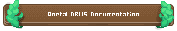

<picture class="full pixels">
    <source srcset="assets/splash-dark.png" media="(prefers-color-scheme: dark)">
    
</picture>

# XDG Desktop Portal

Portals allow [Flatpak](https://flatpak.org) apps, and other desktop containment
frameworks, to interact with the system in a secure and well defined way.

XDG Desktop Portal works by exposing a series of D-Bus interfaces known as
_portals_ to apps. Portals are designed to be usable by all apps, including
ones which are confined by sandboxes, such as Flatpak.

The portal interfaces include APIs for file access, opening
URIs, printing and others.

XDG Desktop Portal works together with desktop environment specific backends to
mediate access to resources and functionality in an integrated manner.

## Documentation

This documentation covers everything you need to know to

- build apps that use portals
- configure and distribute portals as part of a distribution
- write portal backends for your desktop environment
- contribute to this project

<a href="https://flatpak.github.io/xdg-desktop-portal/docs" class="pixelbutton"><picture>
    <source srcset="assets/docs-button-dark.png" media="(prefers-color-scheme: dark)">
    
</picture></a>

## Using Portals

Many toolkits and frameworks already integrate with some portals, and you might
already be using them without realizing it. For all other cases, there are
[Convenience Libraries](https://flatpak.github.io/xdg-desktop-portal/docs/convenience-libraries.html)
and direct [D-Bus access](https://flatpak.github.io/xdg-desktop-portal/docs/api-reference.html).

## Backends

To implement most portals, xdg-desktop-portal relies on a desktop environment
specific backend to provide a part of the functionality.

Here are some examples of available backends:

- GTK [xdg-desktop-portal-gtk](http://github.com/flatpak/xdg-desktop-portal-gtk)
- GNOME [xdg-desktop-portal-gnome](https://gitlab.gnome.org/GNOME/xdg-desktop-portal-gnome/)
- KDE [xdg-desktop-portal-kde](https://invent.kde.org/plasma/xdg-desktop-portal-kde)
- LXQt [xdg-desktop-portal-lxqt](https://github.com/lxqt/xdg-desktop-portal-lxqt)
- Pantheon (elementary OS) [xdg-desktop-portal-pantheon](https://github.com/elementary/portals)
- wlroots [xdg-desktop-portal-wlr](https://github.com/emersion/xdg-desktop-portal-wlr)
- Deepin [xdg-desktop-portal-dde](https://github.com/linuxdeepin/xdg-desktop-portal-dde)
- Xapp (Cinnamon, MATE, Xfce) [xdg-desktop-portal-xapp](https://github.com/linuxmint/xdg-desktop-portal-xapp)
- COSMIC [xdg-desktop-portal-cosmic](https://github.com/pop-os/xdg-desktop-portal-cosmic)

## Contributing

XDG Desktop Portals is [Free Software](https://www.gnu.org/philosophy/free-sw.html).
Contributions [welcome](https://flatpak.github.io/xdg-desktop-portal/docs/for-contributors.html).

Are you an app developer and want a new portal or feature? Contribute to or open
a new [discussion](https://github.com/flatpak/xdg-desktop-portal/discussions).

Is there an issue with the portal frontend? Report it to our
[issue tracker](https://github.com/flatpak/xdg-desktop-portal/issues).

Just want to talk or need help? Join our
[matrix](https://matrix.to/#/#xdg-desktop-portals:matrix.org).
